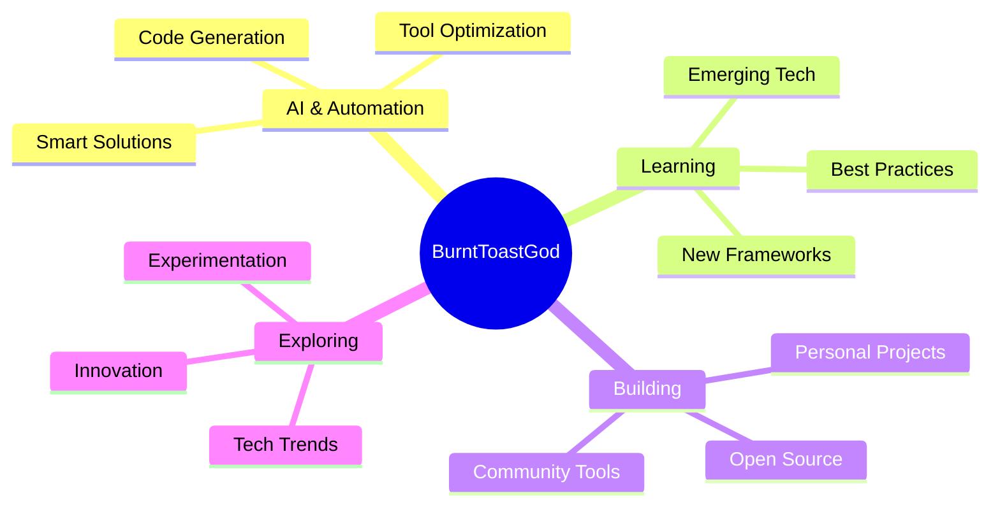

<div align="center">
  
</div>

<div align="center">
  
  [](https://git.io/typing-svg)
  
</div>

<br>

## 🚀 About Me

```python
class BurntToastGod:
    def __init__(self):
        self.username = "BurntToastGod"
        self.location = "Mesa, Arizona 🌵"
        self.interests = ["AI & Machine Learning", "Software Development", 
                         "Open Source", "Automation", "Tech Innovation"]
        self.currently_learning = ["Advanced AI Tools", "Code Generation",
                                  "Cloud Technologies", "DevOps"]
        self.fun_fact = "I turn coffee into code ☕️➡️💻"
    
    def say_hi(self):
        print("Thanks for dropping by! Let's build something amazing together.")

me = BurntToastGod()
me.say_hi()
```

<br>

## 🛠️ Tech Stack & Tools

<div align="center">

### 💻 Languages


### 🤖 AI & Tools


### ⚙️ Platforms & Systems


</div>

<br>

## 📊 GitHub Stats

<div align="center">
  
  
</div>

<div align="center">
  
  
</div>

<br>

## 🏆 GitHub Trophies

<div align="center">
  
</div>

<br>

## 🎯 Current Focus

<div align="center">



</div>

<br>

## 💡 What I'm Up To

- 🔥 Exploring cutting-edge AI tools and automation
- 🌱 Learning new technologies and staying ahead of tech trends
- 🛠️ Building practical solutions to everyday problems
- 🤝 Open to collaborating on innovative projects
- 💻 Optimizing workflows and embracing free/open-source tools
- 🎮 Experimenting with interactive applications and digital creation

<br>

## 🌐 Connect With Me

<div align="center">
  
[](https://github.com/BurntToastGod)
[](https://github.com/BurntToastGod)

</div>

<br>

## 📈 Activity Graph

<div align="center">
  
</div>

<br>

## 💭 Random Dev Quote

<div align="center">
  
</div>

<br>

## 🎵 Vibes While Coding

<div align="center">

*"Great code is written with great music in the background"* 🎧


</div>

<br>

---

<div align="center">
  
### 💬 Let's Build Something Amazing Together!

*"The best way to predict the future is to create it."*

**⭐️ If you like what you see, consider dropping a star on my repositories!**


</div>